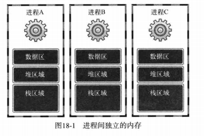
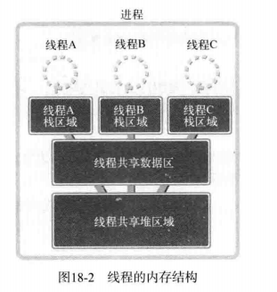
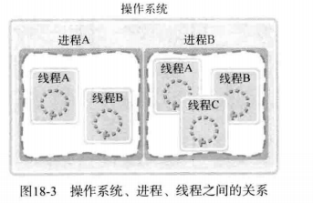
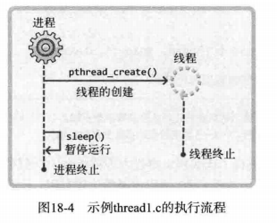
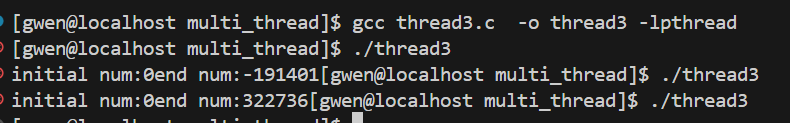

# Chapter18 多线程服务器

## 18.0 编译记得加选项`-lpthread`


## 18.1 理解线程的概念

为了克服线程的缺点, 人们引入线程。 这是一种'轻量级的进程', 具有如下优点:

> - 线程上下文切换更快
> - 线程间交换数据无需特殊的技术


### 	18.1.1 多进程的劣势

- 创建进程(fork)本身会带来一定的系统开销
- 各个进程直接需要通过IPC技术实现进程间通信

**更重要的是：**

- 每秒少则数十次, 多则数千次的'**上下文切换'**是创建进程的最大开销


**什么是上下文切换?**

> 上下文切换（Context Switch）是操作系统管理多任务时的一种关键机制，它涉及将CPU的当前执行状态从一个任务保存并切换到另一个任务。上下文切换的主要目的是实现多任务处理，即在多个进程或线程之间分配CPU时间，从而使它们看起来像是并行执行的。


### 	18.1.2 线程和进程的差异 

- **多进程的内存模型**



- **多线程的内存模型**

  

由此我们发现多进程程序具体如下优势:

> - 上下文切换无需交换数据区和堆区
> - 可以共享数据区和堆区


多个线程共享数据区和堆。为了保持这种结构，线程将在进程内创建并运行。也就是说，进程和线程可以定义为如下形式：

- 进程：在**操作系统**构成单独执行流的单位
- 线程：在**进程**构成单独执行流的单位

如果说进程在操作系统内部生成多个执行流，那么线程就在同一进程内部创建多条执行流。因此，操作系统、进程、线程之间的关系可以表示为下图：




## 18.2 线程的创建与运行


### 	18.2.1 线程的创建

线程具有单独的执行流 , 因此需要定义线程自己的`main()`函数 , 还需要请求操作系统中单独的执行流中执行该函数。

```c++
#include<pthread.h>

int pthread_Create(
    pthread_t * restrict thread , const pthread_attr_t* restrict attr ,
    void*(* start_routine)(void*), void* restrict arg 
);

/*
成功时返回 0 ，失败时返回 -1
restrict thread : 保存新创建线程 ID 的变量地址值。线程与进程相同，也需要用于区分不同线程的 ID
restrict attr : 用于传递线程属性的参数，传递 NULL 时，创建默认属性的线程
start_routine : 相当于线程 main 函数的、在单独执行流中执行的函数地址值（函数指针）
arg : 通过第三个参数传递的调用函数时包含传递参数信息的变量地址值
*/
```

下面通过简单示例了解该函数功能：

```c++
void* thread_main(void* arg)
{
    int i ;
    int cnt = *((int*)arg);
    for(i = 0 ; i<10 ;i++)
    {
        printf("%d\n",i);
        sleep(1);
    }
    return 0 ;
}

int main() {
    pthread_t t_id;
    int thread_arg = 5;
    int j ;
    for(j=0; j<4;j++)
    {
       if (pthread_create(&t_id, NULL, thread_main, (void*)&thread_arg) != 0) {
            perror("Failed to create thread");
            return 1;
          }
    }
    puts("end\n");
    return 0;
}
```

运行结果如下图:


为什么会这样 ? 因为<font color=blue>主线程和各个子线程并发运行, 但是主线程无法预知何时子线程结束运行, 也不会等待子线程退出</font> , **当主线程运行完成后 , 子线程自动退出**。



**因此需要有函数来控制主线程 ,使得能够等待子线程顺利退出**


### 18.2.2 防止主线程提前退出

```C
#include <pthread.h>

int pthread_join(pthread_t thread, void **retval);
/*
成功时返回 0 ，失败时返回 -1
thread : 该参数值 ID 的线程终止后才会从该函数返回
retval : 一个指向指针的指针，用于存储被等待线程的返回值。如果你不需要线程的返回值，可以传递 NULL。
*/
```

- **为什么retval是一个二级指针?**

`retval` 是一个二级指针（`void**`），是因为它要传递线程函数的返回值，而线程函数的返回值是一个指针类型（`void*`）。使用二级指针允许 `pthread_join` 函数将线程的返回值传递回主线程。


**更改后的示例:**

```c
//主程序传入子线程参数稍有改动 , 更能体现join的作用
int main()
{
   
    pthread_t thread_arr[4];
    int j = 0 ;
    for(j = 0 ; j<4 ; j++)
    {
        if(pthread_create(&thread_arr[j], NULL ,thread_main , (void*)&thread_arr[j] )!=0)
        {
            puts("error \n");
        }
    }
    // 等待所有线程完成
    for(j = 0 ; j<4 ;j++)
    {
        if(pthread_join(thread_arr[j],NULL)!=0)
        {
            puts("Error\n");
        }
    }
    puts("end\n");
    return 0;
}
```


​	

## 18.3 线程间存在的问题和临界区


### 	18.3.1 多个线程访问同一全局变量

**请看如下代码:**

```c
#define SZ 100
long long num =0;

void* odd_thread (void* arg)
{
    int i ;
    for( i = 0 ;i<100000;i++)
    {
        num-=1;
    }
}

void* even_thread (void* arg)
{
    int i ;
    for( i = 0 ;i<100000;i++)
    {
        num+=1;
    }
}

int main()
{
    printf("initial num:%d",num);

    pthread_t  t_ids[SZ];
    int i ;
    for(i=0 ; i<SZ ; i++)
    {
         if(i%2)
         {
             pthread_create(&t_ids[i],NULL , odd_thread , NULL);
         }
         else{
             pthread_create(&t_ids[i],NULL , even_thread , NULL);
         }
    }
    for(i=0 ; i<SZ ; i++)
    {
        pthread_join(t_ids[i],NULL);
    }
    printf("end num:%d",num);
}
```

理论上来说,经过主程序的循环之后, `num`仍然=0 但是事实上的运行结果如下: 



<font color=red>原因: 当前一个线程对全局操作变量操作完毕后 ,**但并未来得及将操作结果写入num变量** 后一个线程立马便开始了对该变量的操作 </font>

**因此线程同步显得尤为重要**

### 	18.3.2 临界区

**定义: 函数内同时运行多个线程时引起问题的多条语句构成的<font color=blue>代码块</font>**

两条不同语句(分别定义在不同的函数内)同时执行时, 也可能构成临界区 **,前提是这两条语句访问同一内存空间**


## 18.4 线程同步

- #### 同步 --Synchronization

**线程同步用于解决线程访问顺序引发的问题:**

- 同时访问同一内存空间的情况
- 需要指定访问同一内存空间先后顺序的情况


**<font size=4>线程同步主要分 互斥量(mutex) 和 信号量(semaphore)两种同步技术</font>**


### 		18.4.1 互斥量(锁)

 **互斥量"mutual Exclusion"** 表示不允许多个线程同时访问。


- #### 互斥锁的初始化和销毁

```c
#include<pthread.h>

int pthread_mutex_init (pthread_mutex_t *mutex , const phtread_mutaxattr_t *attr);
int pthread_mutex_init (phtread_mutex_T *mutex);
/*
成功时返回 0，失败时返回其他值
mutex : 创建互斥量时传递保存互斥量的变量地址值，销毁时传递需要销毁的互斥量地址
attr : 传递即将创建的互斥量属性，没有特别需要指定的属性时传递 NULL
*/
```

从上述函数声明中可以看出，为了创建相当于锁系统的互斥量，需要声明如下 `pthread_mutex_t `型变量：

```C
pthread_mutex_t mutex
```

该变量的地址值传递给` pthread_mutex_init `函数，用来保存操作系统创建的互斥量（锁系统）。调用 `pthread_mutex_destroy `函数时同样需要该信息。如果不需要配置特殊的互斥量属性，则向第二个参数传递 NULL 时，可以利用 PTHREAD_MUTEX_INITIALIZER 进行如下声明：

```c
pthread_mutex_t mutex = PTHREAD_MUTEX_INITIALIZER;
```

**推荐尽可能的使用 `pthread_mutex_init` 函数进行初始化，因为通过宏进行初始化时很难发现发生的错误。**

- #### 互斥锁的上锁和解锁

```c
#include <pthread.h>
int pthread_mutex_lock(pthread_mutex_t *mutex);
int pthread_mutex_unlock(pthread_mutex_t *mutex);
/*
成功时返回 0 ，失败时返回其他值
*/
```

函数本身含有 lock unlock 等词汇，很容易理解其含义。进入临界区前调用的函数就是 `pthread_mutex_lock` 。调用该函数时，发现有其他线程已经进入临界区，则`pthread_mutex_lock` 函数不会返回，直到里面的线程调用 `pthread_mutex_unloc`k 函数退出临界区位置。也就是说，其他线程让出临界区之前，当前线程一直处于阻塞状态。接下来整理一下代码的编写方式：

```
pthread_mutex_lock(&mutex);
//临界区开始
//...
//临界区结束
pthread_mutex_unlock(&mutex);
```


简言之，就是利用 lock 和 unlock 函数围住临界区的两端。此时互斥量相当于一把锁，阻止多个线程同时访问，还有一点要注意，线程退出临界区时，<font color=purple>**如果忘了调用 `pthread_mutex_unlock` 函数，那么其他为了进入临界区而调用 `pthread_mutex_lock `的函数无法摆脱阻塞状态。这种情况称为「死锁」**。</font>

#### 			18.4.1.2 互斥锁在程序中定义的位置

- ####  **局部变量（临时锁）**

**适用场景**：当你只需要在某个函数或代码块中保护资源时，可以在函数内部定义互斥锁。

- #### **全局或类成员变量**

**适用场景**：当互斥锁用于保护全局共享资源或类的成员变量时，互斥锁通常定义为全局变量或类的成员变量。这确保了所有需要访问该资源的线程都能够访问同一个互斥锁。


```c
//加了互斥锁跑的有点慢
void* thread_main(void* arg)
{
    int i ;
    int cnt = *((int*)arg);
    for(i = 0 ; i<10 ;i++)
    {
        printf("%d\n",i);
        sleep(1);
    }
    return 0 ;
}

 
int main() {
    pthread_t t_id;
    int thread_arg = 5;

    int j ;
    for(j=0; j<4;j++)
    {
       if (pthread_create(&t_id, NULL, thread_main, (void*)&thread_arg) != 0) {
            perror("Failed to create thread");
            return 1;
    }
    }
    puts("end\n");
    return 0;
}
```


### 	18.4.2 信号量

信号量（英语：Semaphore）又称为信号标，是一个同步对象，用于保持在0至指定最大值之间的一个计数值。

- 当线程完成一次对该semaphore对象的等待（wait）时，该计数值减一；

- 当线程完成一次对该semaphore对象的释放（release）时,  该计数值加一。

- 当计数值为0，则线程等待该semaphore对象不再能成功直至该semaphore对象变成`signaled`状态。semaphore对象的计数值大于0，为`signaled`状态；计数值等于0，为`nonsignaled`状态.

**semaphore对象适用于控制一个仅支持有限个用户的共享资源， 是一种不需要使用忙碌等待（busy waiting）的方法。**

> 信号量的概念是由荷兰计算机科学家艾兹赫尔·戴克斯特拉（Edsger W. Dijkstra）发明的，广泛的应用于不同的操作系统中。在系统中，给予每一个进程一个信号量，代表每个进程当前的状态，未得到控制权的进程会在特定地方被强迫停下来，等待可以继续进行的信号到来。如果信号量是一个任意的整数，通常被称为**计数信号量**（Counting semaphore），或一**般信号量**（general semaphore）；如果信号量只有二进制的0或1，称为**二进制信号量**（binary semaphore）。**在linux系统中，二进制信号量（binary semaphore）又称互斥锁（Mutex）。**


下面介绍信号量，在互斥量的基础上，很容易理解信号量。此处只涉及利用「二进制信号量」（只用 0 和 1）完成「控制线程顺序」为中心的同步方法。下面是信号量的创建及销毁方法：

```c
#include <semaphore.h>
int sem_init(sem_t *sem, int pshared, unsigned int value);
int sem_destroy(sem_t *sem);
/*
成功时返回 0 ，失败时返回其他值
sem : 创建信号量时保存信号量的变量地址值，销毁时传递需要销毁的信号量变量地址值
pshared : 传递其他值时，创建可由多个继承共享的信号量；传递 0 时，创建只允许 1 个进程内部使用的信号量。需要完成同一进程的线程同步，故为0
value : 指定创建信号量的初始值
*/
```


```c
#include <semaphore.h>
int sem_post(sem_t *sem);
int sem_wait(sem_t *sem);
/*
成功时返回 0 ，失败时返回其他值
sem : 传递保存信号量读取值的变量地址值，传递给 sem_post 的信号量增1，传递给 sem_wait 时信号量减一
*/
```

调用 `sem_init` 函数时，操作系统将创建信号量对象，此对象中记录这「信号量值」（Semaphore Value）整数。该值在调用 `sem_post `函数时增加 1 ，调用 `sem_wait` 函数时减一。但信号量的值不能小于 0 ，因此，在信号量为 0 的情况下调用 `sem_wait `函数时，调用的线程将进入阻塞状态（因为函数未返回）。当然，此时如果有其他线程调用` sem_post `函数，信号量的值将变为 1 ，而原本阻塞的线程可以将该信号重新减为 0 并跳出阻塞状态。实际上就是通过这种特性完成临界区的同步操作，可以通过如下形式同步临界区（假设信号量的初始值为 1）

```c
sem_wait(&sem);//信号量变为0...
// 临界区的开始
//...
//临界区的结束
sem_post(&sem);//信号量变为1... 
```

上述代码结构中，`ser_Wait`调用  函数进入临界区的线程在调用 `sem_post `函数前不允许其他线程进入临界区。信号量的值在 0 和 1 之间跳转，因此，具有这种特性的机制称为「二进制信号量」。接下来的代码是信号量机制的代码。下面代码并非是同时访问的同步，而是关于控制访问顺序的同步，该场景为：

> 线程 A 从用户输入得到值后存入全局变量 num ，此时线程 B 将取走该值并累加。该过程一共进行 5 次，完成后输出总和并退出程序。

下面是代码：

```c
.....
#include<semaphore.h>

static sem_t sem_one  ; // 0
static sem_t sem_two ; //1
static int num = 0 ;
void* read(void* arg)
{
    int cnt = *((int*)arg);
    int i = 0;
    for(i = 0 ; i<cnt ; i++)
    {
       fputs("input the num: ", stdout);
       sem_wait(&sem_two);
       scanf("%d", &num);
       sem_post(&sem_one);
    }
    return ;
}

void * accu(void* arg)
{
    int cnt = *((int*)arg);
    int sum = 0;
    int i ;
    for(i = 0 ; i<cnt ; i++)
    {
       sem_wait(&sem_one);
       sum+=num ;
       sem_post(&sem_two);
    }
    printf("res= %d\n",sum);
    return ;
}

int main()
{
     pthread_t t_input ;
     pthread_t t_output ;
     int cnt  ;  

     puts("input the count:");
     scanf("%d",&cnt);
     sem_init(&sem_one , 0 , 0);
     sem_init(&sem_two , 0 , 1);
     pthread_create(&t_input , NULL , read , (void*)&cnt);
     pthread_create(&t_output , NULL , accu , (void*)&cnt);

     pthread_join(t_input,NULL);
     pthread_join(t_output,NULL);

     sem_destroy(&sem_one);
     sem_destroy(&sem_two);
     puts("end\n");
     return 0 ;
}
```

- #### 为什么需要两个信号量：

1. **`sem_two` 控制 `read` 线程**：防止 `read` 线程在 `accu` 线程处理完上一次输入之前进行新的输入，确保 `num` 的值不会被覆盖。
2. **`sem_one` 控制 `accu` 线程**：防止 `accu` 线程在 `read` 线程输入新数据之前处理数据，确保 `accu` 线程处理的数据是最新的。


## 18.5 线程销毁

在多线程编程中，`pthread_detach`、`pthread_join` 和 `pthread_exit`（用于销毁线程）都有各自的用途，处理线程的生命周期和资源管理。以下是它们之间的区别和用途：

### 	18.5.1``pthread_detach：

- **功能**：将一个线程从“可连接（joinable）”状态分离出来，使其成为“分离（detached）”状态。

- **用途**：当不需要等待线程的结束时，使用 `pthread_detach` 分离线程，允许线程在结束时自动释放其资源（如堆栈空间）。这意味着主线程或其他线程不需要再调用 `pthread_join` 来回收该线程的资源。

- **典型场景**：用于创建后台线程或不需要等待结果的工作线程。

- **代码示例**：

  ```c
  c复制代码pthread_t thread;
  pthread_create(&thread, NULL, thread_function, NULL);
  pthread_detach(thread);  // 分离线程
  // 不需要再调用 pthread_join
  ```

- **注意事项**：分离的线程在结束时会自动清理自己，但主线程无法使用 `pthread_join` 来等待它的结束或获取它的返回值。

### 	18.5.2. pthread_join：

- **功能**：等待一个线程的结束，并回收其资源。调用 `pthread_join` 的线程会阻塞，直到被等待的线程终止。可以通过 `pthread_join` 获取线程的返回值。

- **用途**：在需要等待某个线程完成并获取其返回值时使用。它确保了线程的资源（如堆栈）被正确回收，防止内存泄漏。

- **典型场景**：当主线程需要等待工作线程完成任务并获取结果时使用。

- 代码示例：

  ```c
  c复制代码pthread_t thread;
  pthread_create(&thread, NULL, thread_function, NULL);
  pthread_join(thread, NULL);  // 等待线程结束并回收资源
  ```

- **注意事项**：`pthread_join` 只能对“可连接（joinable）”的线程调用。如果对分离状态的线程调用 `pthread_join`，会导致错误。

### 	18.5.3. pthread_exit：

- **功能**：终止当前线程的执行，并返回指定的退出状态。调用 `pthread_exit` 后，线程会终止执行，并且该线程的退出状态会被其他线程通过 `pthread_join` 获取。

- **用途**：当线程需要在某个时刻自行终止时使用（通常在主线程中使用，防止主线程提前结束）。

- **典型场景**：当一个线程完成任务并需要返回一个状态值给 `pthread_join` 时使用。主线程也可以调用 `pthread_exit` 来避免提前结束，从而等待其他工作线程完成。

- 代码示例：

  ```c
  c复制代码void* thread_function(void* arg) {
      // 线程任务执行
      pthread_exit(NULL);  // 线程终止
  }
  ```

- **注意事项**：主线程调用 `pthread_exit` 后不会立即退出，而是允许其他线程继续执行。与 `exit()` 不同，`pthread_exit()` 只终止调用它的线程，而不会终止整个进程。

### 	18.5.4常见使用场景：

1. 分离线程（后台任务）：
   - 使用 `pthread_detach`，线程结束后自动清理资源。
2. 等待线程完成（前台任务）：
   - 使用 `pthread_join`，等待线程结束并获取返回值。
3. 线程主动终止：
   - 使用 `pthread_exit`，在完成任务后主动终止线程。

### 	18.5.5注意：

- `pthread_join` 和 `pthread_detach` 是互斥的，你只能选择其中之一来处理线程。如果调用了 `pthread_detach`，则不能再调用 `pthread_join`。
- 错误地处理线程的终止和资源回收可能会导致内存泄漏或未定义行为，因此需要谨慎管理线程的生命周期。


## 18.6 多人聊天室客户端服务器代码

详见代码详情

