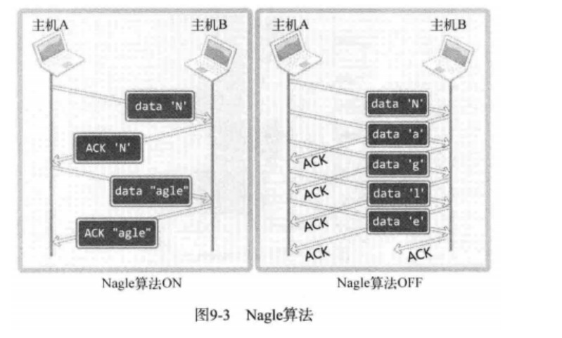

# Chapter9.多种版本套接字


### 9.1 套接字可选项和 I/O 缓冲大小


我们进行套接字编程时往往只关注数据通信，而忽略了套接字具有的不同特性。但是，理解这些特性并根据实际需要进行更改也很重要

#### 9.1.1 套接字多种可选项


我们之前写得程序都是创建好套接字之后直接使用的，此时通过默认的套接字特性进行数据通信，这里列出了一些套接字可选项。

| 协议层      | 选项名            | 读取 | 设置 |
| ----------- | ----------------- | ---- | ---- |
| SOL_SOCKET  | SO_SNDBUF         | O    | O    |
| SOL_SOCKET  | SO_RCVBUF         | O    | O    |
| SOL_SOCKET  | SO_REUSEADDR      | O    | O    |
| SOL_SOCKET  | SO_KEEPALIVE      | O    | O    |
| SOL_SOCKET  | SO_BROADCAST      | O    | O    |
| SOL_SOCKET  | SO_DONTROUTE      | O    | O    |
| SOL_SOCKET  | SO_OOBINLINE      | O    | O    |
| SOL_SOCKET  | SO_ERROR          | O    | X    |
| SOL_SOCKET  | SO_TYPE           | O    | X    |
| IPPROTO_IP  | IP_TOS            | O    | O    |
| IPPROTO_IP  | IP_TTL            | O    | O    |
| IPPROTO_IP  | IP_MULTICAST_TTL  | O    | O    |
| IPPROTO_IP  | IP_MULTICAST_LOOP | O    | O    |
| IPPROTO_IP  | IP_MULTICAST_IF   | O    | O    |
| IPPROTO_TCP | TCP_KEEPALIVE     | O    | O    |
| IPPROTO_TCP | TCP_NODELAY       | O    | O    |
| IPPROTO_TCP | TCP_MAXSEG        | O    | O    |

从表中可以看出，套接字可选项是分层的。

- *IPPROTO_IP* 可选项是IP协议相关事项
- *IPPROTO_TCP* 层可选项是 TCP 协议的相关事项
- *SOL_SOCKET* 层是套接字的通用可选项。

## 9.2获取和设置套接字选项

```c++
int getsockopt(int sock ,int level , int optname , void*optval , socklen_t* optlen)
   //成功返回 0  失败返回 -1 
   //if : true-> 0 false->!0 sock: 用于查看选项套接字文件描述符
/*    
level: 要查看的可选项协议层
optname: 要查看的可选项名
optval: 保存查看结果的缓冲地址值
optlen: 向第四个参数传递的缓冲大小。调用函数候，该变量中保存通过第四个参数返回的可选项信息的字节数。
*/
int setsockopt(int sock ,int level ,int optname , const void* optval , socklen_t optlen);
/*
sock: 用于更改选项套接字文件描述符
level: 要更改的可选项协议层
optname: 要更改的可选项名
optval: 保存更改结果的缓冲地址值
optlen: 向第四个参数传递的缓冲大小。调用函数后，该变量中保存通过第四个参数返回的可选项信息的字节数。
*/
```


## 9.3举例介绍部分可选项

###   9.3.1 SO_SNDBUF & SO_RCVBUF

通过这两个选项可以修改或者查看 输入/输出缓冲区的大小

示例:

```c++
int state = getsockopt(sock ,SOL_SOCKET,SO_SNDBUF , (void*)&snd_buf , &snd_buf_len)
if(State) error_handling("get snd_buf error!!\n");
```

- 注意: 缓冲区大小**系统不一定会按照你设定的去开辟**

  

###    9.3.2 SO_REUSEADDR

设置该选项值为1(真),可以将**time wait状态的套接字端口分配新的套接字** 。

但是默认情况: 该选项值为0(假)

- time_wait 状态一般持续:2MSL(1min)
- 如果说服务器端套接字被迫关闭 (Ctrl+C) 需要等待几分钟后才能使用该端口 ,否则在端口绑定时会出现bind error
- 客户端端口号不需要自己手动绑定,且是随机分配

###    9.3.3 TCP_NODELAY

为了防止因数据包过多而发生网络过载，`Nagle` 算法诞生了。它应用于 TCP 层。它是否使用会导致如图所示的差异



图中展示了通过 `Nagle` 算法发送字符串 `Nagle` 和未使用 `Nagle` 算法的差别。可以得到一个结论。

**只有接收到前一数据的 ACK 消息， `Nagle` 算法才发送下一数据。**

关于这个算法，可以参考这个回答：[TCP连接中启用和禁用TCP_NODELAY有什么影响？](https://www.zhihu.com/question/42308970/answer/246334766)